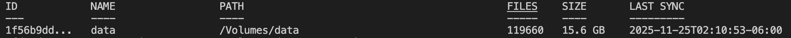

# StormIndexer

A powerful file indexing and syncing tool written in Go. StormIndexer allows you to index files across multiple disks, machines, and external drives, track file metadata, calculate checksums, and synchronize files using rsync.

For years a dream, now a reality—forged without friction by the quick hand of AI.
Forged in Go—to escape the lethargy of Ruby, the compatibility quagmires of Python, and the cryptic nature of Rust.

WARNING: This project is in very early development. It requires much more human validation and is not yet usable.

## Features

- **Fast File Indexing**: Quickly scan and index large directory structures
- **Checksum Calculation**: Optional SHA256 checksums for duplicate detection
- **Cross-Machine Sync**: Compare and sync files across different machines and drives
- **File Synchronization**: Uses rsync under the hood for efficient file copying
- **Change Detection**: Track file additions, updates, and deletions
- **Duplicate Detection**: Find duplicate files across all indexed locations
- **Advanced File Search**: Search files across multiple drives with pattern matching, date filtering, and more
- **SQLite Database**: Lightweight, portable database storage
- **CLI Interface**: Easy-to-use command-line interface

## Installation

### Prerequisites

- Go 1.21 or later
- rsync (for file synchronization features)

### Build from Source

```bash
git clone git@github.com:jvmvik/stormindexer.git
cd stormindexer
go mod download
go build -o stormindexer
```

### Limitation 

 - Dependency on rsync 
    - windows: `install wsl`
    - macOS : `brew install rsync`
    - Linux : `apt install rsync` (Debian/Ubuntu) or `pacman install rsync` (Arch) or `rpm install rsync` (Fedora/CentOS/Redhat)

## Usage

### Index a Directory

Index all files in a directory:

```bash
# Basic indexing
./stormindexer index /path/to/directory

# Index with checksums (slower but enables duplicate detection)
./stormindexer index /path/to/directory --checksums

# Index with a custom name
./stormindexer index /path/to/directory --name "My External Drive"

# Force reindex even if index exists
./stormindexer index /path/to/directory --force
```

### List Indexes

View all indexed locations:

```bash
./stormindexer list
```



### List Files in an Index

View all files in a specific index:

```bash
./stormindexer list files <name|path>
```

### Find Files

Search for files across all indexes with flexible filtering options:

```bash
# Find files by name pattern (supports wildcards: *, ?)
./stormindexer find --name "*.pdf"

# Find files in a specific directory
./stormindexer find --dir "documents"

# Find files by checksum
./stormindexer find --checksum abc123def456...

# Find files by size (supports >, <, =, >=, <=)
./stormindexer find --size ">100M"
./stormindexer find --size "<1G"
./stormindexer find --size "=500K"

# Find files modified since a date (supports relative dates like git)
./stormindexer find --since "2 weeks ago"
./stormindexer find --since "2024-01-15"
./stormindexer find --since "yesterday"

# Find files modified until a date
./stormindexer find --until "2024-01-20"
./stormindexer find --until "yesterday"

# Find files in a date range
./stormindexer find --since "2024-01-01" --until "2024-01-31"

# Filter by file type
./stormindexer find --type file --name "*.pdf"    # Only files
./stormindexer find --type dir --dir "backup"     # Only directories
./stormindexer find --type all                    # Both files and directories (default)

# Limit search to specific indexes
./stormindexer find --name "*.pdf" --index "nas/serpapi" --index "nas/serpapi-golang"

# Find duplicate files (grouped by checksum and drive)
./stormindexer find --duplicates
./stormindexer find -d --name "*.pdf"             # Duplicates with name filter

# Combine multiple filters
./stormindexer find --name "*.pdf" --dir "documents" --since "1 month ago"
```

**Find Command Features:**

- **Pattern Matching**: Supports shell-style wildcards (`*` for any characters, `?` for single character)
- **Directory Search**: Search by directory name patterns anywhere in the path
- **Date Filtering**: Supports both relative dates (e.g., "2 weeks ago", "yesterday") and absolute dates (ISO format)
- **Size Filtering**: Filter by file size with comparison operators
- **Duplicate Detection**: Find duplicate files grouped by checksum and drive
- **Type Filtering**: Filter results to show only files, only directories, or both
- **Cross-Drive Search**: Search across all indexed drives simultaneously

**Output Format:**

- Regular searches display results in a table format with path, size, modification date, checksum, and drive
- Duplicate searches group results by checksum, then by drive, making it easy to see where duplicates exist

### Reindex

Update an existing index to reflect changes:

```bash
./stormindexer reindex <name|path>
./stormindexer reindex <name|path> --checksums
```

### Remove an Index

Remove an indexed directory from the database:

```bash
# Show what will be removed (requires --force to actually remove)
./stormindexer remove <name|path>

# Actually remove the index (skips confirmation)
./stormindexer remove <name|path> --force
```

**Note**: This only removes the index from the database. It does NOT delete the actual files on disk.

### Compare Indexes

Compare two indexes to see differences:

```bash
./stormindexer compare <name-1> <name-2>
```

### Sync Indexes

Sync files from one index to another using rsync:

```bash
# Dry run (show what would be synced)
./stormindexer sync <source-name> <target-name> --dry-run

# Actual sync (copies files using rsync)
./stormindexer sync <source-name> <target-name>

# Sync and delete extra files in target (use with caution!)
./stormindexer sync <source-name> <target-name> --delete
```

**Note**: The sync command uses `rsync` to perform actual file copying. It preserves file permissions, timestamps, and other metadata. The `--delete` flag will remove files in the target that don't exist in the source, making the target an exact mirror.

### Find Duplicates

Find duplicate files across all indexes:

```bash
./stormindexer duplicates
```

### Database Statistics

Show database file location, size, and statistics:

```bash
./stormindexer stat
```

This displays:
- Database file path and size on disk
- Total number of indexes
- Total files indexed across all indexes
- Total size of indexed files
- Per-index breakdown with file counts and sizes

## Configuration

StormIndexer uses a configuration file located at `~/.stormindexer/config.yaml`. You can also create a `config.yaml` in the current directory.

Example configuration:

```yaml
database_path: ".stormindexer.db"
machine_id: "my-computer"
```

## Database

By default, StormIndexer stores its database in `.stormindexer.db` in the current directory. You can change this in the configuration file.

## Use Cases

1. **Backup Verification**: Index your backup drives and compare with source to ensure everything is backed up
2. **Duplicate Cleanup**: Find duplicate files across multiple drives
3. **File Synchronization**: Keep files in sync across multiple machines or external drives
4. **Change Tracking**: Monitor changes in directory structures over time
5. **Archive Management**: Index and track files across multiple archive locations
6. **File Discovery**: Quickly find files across multiple drives by name, directory, date, size, or checksum

## Examples

### Index Multiple External Drives

```bash
# Index first drive
./stormindexer index /Volumes/Drive1 --name "Backup Drive 1" --checksums

# Index second drive
./stormindexer index /Volumes/Drive2 --name "Backup Drive 2" --checksums

# Compare them
./stormindexer compare <name-1> <name-2>
```

### Sync Files Between Machines

```bash
# On machine 1: Index the source directory
./stormindexer index /home/user/documents --name "Machine1 Documents" --checksums

# On machine 2: Index the target directory
./stormindexer index /home/user/documents --name "Machine2 Documents" --checksums

# Copy the database file to machine 2, then compare
./stormindexer compare <machine1-name> <machine2-name>
```

## Project Structure

```
stormindexer/
├── cmd/           # CLI commands
├── internal/
│   ├── config/    # Configuration management
│   ├── database/  # Database layer
│   ├── indexer/   # File indexing engine
│   ├── models/    # Data models
│   └── sync/      # Synchronization engine
├── main.go        # Entry point
└── go.mod         # Go module definition
```

## License

MIT License

## Contributing

Contributions are welcome! Please feel free to submit a Pull Request.

